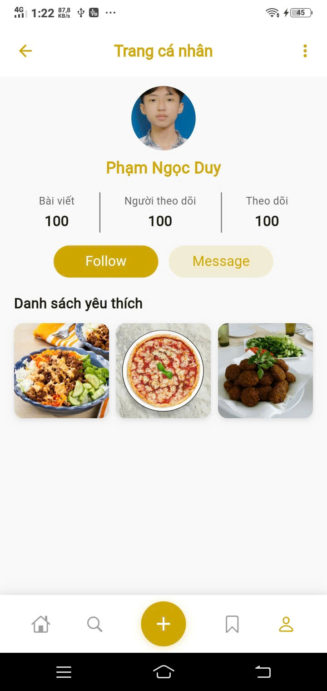

# Recipe App - Flutter Mobile Application

A modern and feature-rich recipe discovery mobile application built with Flutter, featuring clean architecture, state management with BLoC pattern, and a beautiful user interface.

## App Overview

Recipe App is a comprehensive mobile application that allows users to discover, search, and save delicious recipes from around the world. The app features an intuitive interface with modern design principles and smooth user experience.

## Key Features

- **Recipe Discovery**: Browse recipes by categories, ingredients, and locations
- **Advanced Search**: Search recipes with multiple filter options
- **Recipe Details**: Comprehensive recipe information with ingredients and instructions
- **Favorites System**: Save and manage your favorite recipes
- **User Profiles**: Personalized user experience with profile management
- **Modern UI/UX**: Beautiful, responsive design with smooth animations
- **Offline Support**: Access saved recipes without internet connection

## Architecture & Technology 

- **Framework**: Flutter (Latest stable version)
- **State Management**: BLoC (Business Logic Component) pattern
- **Architecture**: Clean Architecture with Feature-based structure
- **Dependency Injection**: Manual DI implementation
- **Network Layer**: Dio HTTP client with proper error handling
- **Data Persistence**: Local storage for favorites and saved recipes
- **Code Generation**: Freezed for immutable models, JSON serialization

## App Interface

### 1. Onboarding & Home Screen


### 2. Recipe Categories & Discovery


### 3. Recipe Details & Information


### 4. Search & Filtering


### 5. User Profile & Favorites


## Getting Started

### Prerequisites

- **Flutter SDK**: Version 3.16.0 or higher
- **Dart SDK**: Version 3.2.0 or higher
- **Android Studio** or **VS Code** with Flutter extensions
- **Android SDK** (API level 21+) for Android development

### Installation Steps

1. **Clone the repository**
   ```bash
   git clone https://github.com/yourusername/recipe_app.git
   cd recipe_app
   ```

2. **Install Flutter dependencies**
   ```bash
   flutter pub get
   ```

3. **Run the app**
   ```bash
   # For Android
   flutter run
   
   # For iOS (macOS only)
   flutter run -d ios
   
   # For web
   flutter run -d chrome
   ```
